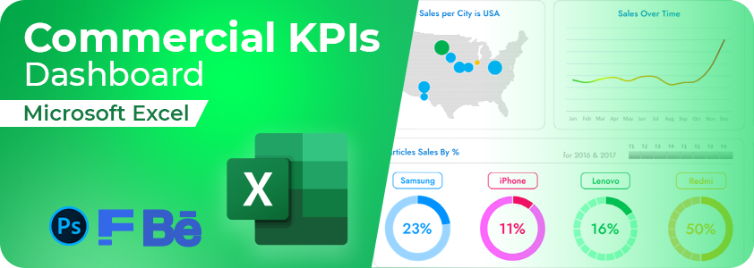
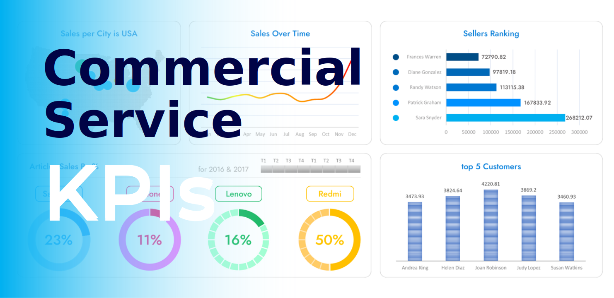

# Commercial Service KPIs Excel Dashboard

An Excel dashboard that tracks and analyzes sales data for products, sellers, and clients across various USA states using pivot tables, advanced filters, and visualizations and much more.




## Usage

Use the [excel](https://www.microsoft.com/fr-fr/microsoft-365/excel) file to get the dashboard

```bash
Commercial Services KPIs Excel Dashboard.xlsx
```

## Details
The Excel file includes three sheets:

- Dataset: The raw data table with columns like Seller, Customer, Product, Quantity, Price, etc.
- Data Preprocessing: Processed data needed for the dashboard, derived from the Dataset sheet.
- Dashboard: Contains the visualizations and metrics.

## Demo



## Contact

[LinkedIn](https://www.linkedin.com/in/akhatarmourad/)
